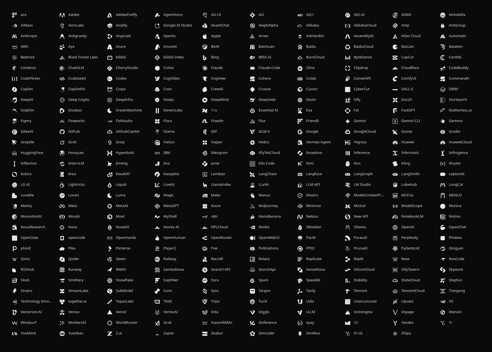

<div align="center">

# Lobe Icons Font

A glyph font of **309 monochrome AI / LLM provider logos** for terminals,
status bars, and the web.

[Browse the icons](https://hschne.github.io/lobe-icons-font/) ·
[Source icons by LobeHub](https://github.com/lobehub/lobe-icons)



</div>

## Install

Download `lobe-icons.ttf` from the [latest release](https://github.com/hschne/lobe-icons-font/releases/latest),
then install it.

```bash
# Download the font
curl -L -o lobe-icons.ttf https://github.com/hschne/lobe-icons-font/releases/latest/download/lobe-icons.ttf
```

## Use

The font uses plane 15, so only terminals with font-fallback mechnaism are supported.

```ini
# kitty
symbol_map U+F4000-U+F47FF lobe-icons

# ghostty
font-codepoint-map = U+F4000-U+F47FF=lobe-icons

# foot
font=Your Mono:size=11, lobe-icons:size=11
```

On the **Web**, load the hosted stylesheet and use a class per icon:

```html
<link
  rel="stylesheet"
  href="https://hschne.github.io/lobe-icons-font/assets/lobe-icons.css"
/>
<i class="li li-anthropic"></i>
```

## Development

```bash
npm run build
```

The build is one Node script. It collects monochrome icons from `@lobehub/icons/es/*/components/Mono.js` and generates the TTF. The package version and releases mirror `@lobehub/icons`.

## Credits & license

Icons are from [LobeHub](https://github.com/lobehub/lobe-icons). Brand logos may
be subject to their owners' trademarks and copyright — fine for personal use,
check before redistributing. The build tooling in this repo is MIT licensed.
